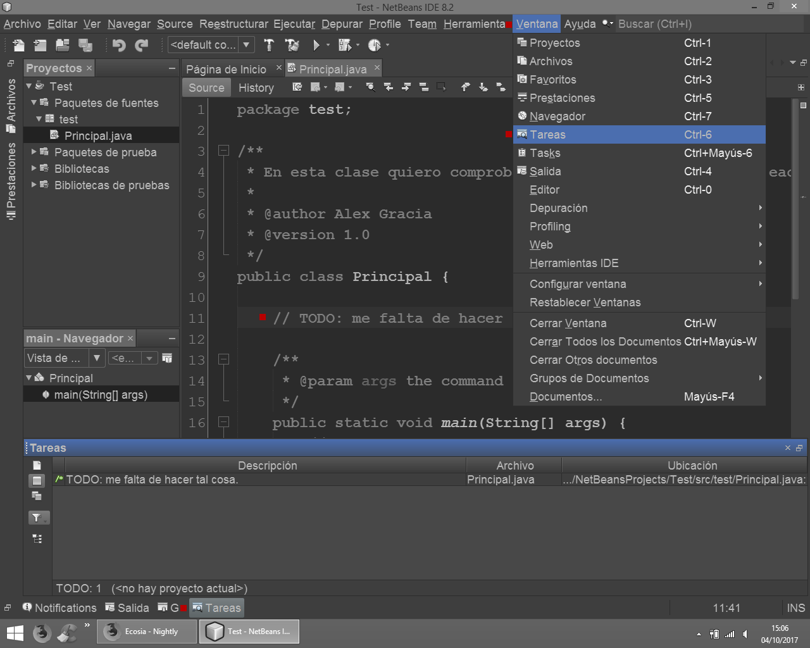

## :tada: Contribuir a Codigo_util :confetti_ball:
En este documento se ofrecen pautas para contribuir con Codigo_util.

### Tipo de proyectos
Los proyectos representan programas de consola o linea de comandos.
* Entrada de datos, para pedir datos se utiliza el siguiente codigo:
  ```java
  Scanner sc = new Scanner(System.in);
  String textoIntroducido = sc.next();
  ```
* Salida de datos, para mostrar mensajes se utiliza el siguiente codigo:
  ```java
  System.out.println("Mensaje a mostrar");
  ```

### Tareas
Para acordarnos de lo que queremos programar es bueno comentar el codigo usando la palabra reservada ```TODO```, en GitHub
tambien podemos crear un [issue](../../../issues) con el label TODO.

Para abrir la ventana de las tareas en NetBeans, basta con pulsar las teclas <kbd>Ctrl</kbd>+<kbd>6</kbd>.
<br>O bien siguiendo los pasos de la siguiente imagen


Para crear un comentario ```TODO``` en el codigo fuente, hay que escribir ```//TODO: ``` seguido de una descripcion de la tarea.

Quitar los comentarios ```TODO``` cuando ya no sean necesarios.

## Estructura del proyecto
> :open_file_folder: Codigo_util/
>> :open_file_folder: NombreProyecto/
>>> :open_file_folder: Lenguaje_utilizado/
>>>> :open_file_folder: src/
>>>>> :file_folder: nombreAutor/
>>>>
>>>> :page_facing_up: README.md
>>>>
>>>> ...

### Ejemplos de estructura de proyecto
* [Hilos-Threads](../Hilos-Threads/Java)
* [StringOrNumber](../StringOrNumber/Java)

### Librerias
Si el proyecto necesita librerias, hay que crear una carpeta "___lib___" en el directorio del proyecto y guardar las librerias en dicha carpeta.
> :open_file_folder: Codigo_util/
>> :open_file_folder: NombreProyecto/
>>> :open_file_folder: Lenguaje_utilizado/
>>>> :file_folder: src/
>>>>
>>>> :open_file_folder: ___lib___/
>>>>> :page_facing_up: nombreLibreria.jar
>>>>>
>>>>> ...
>>>>
>>>> ...

### Bases de datos
Si el proyecto necesita una base de datos, hay que crear una carpeta "___database___" en el directorio del proyecto y guardar la base de datos en dicha carpeta.
> :open_file_folder: Codigo_util/
>> :open_file_folder: NombreProyecto/
>>> :open_file_folder: Lenguaje_utilizado/
>>>> :file_folder: src/
>>>>
>>>> :open_file_folder: ___database___/
>>>>> :page_facing_up: nombreBaseDeDatos.sql
>>>>
>>>> ...
