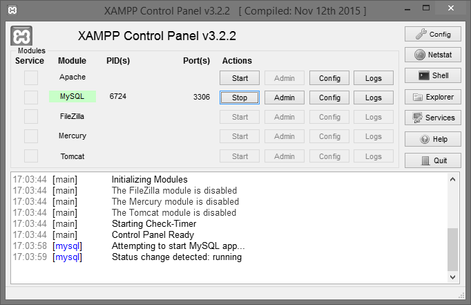

## Proyecto MySQL en Java
En este proyecto se pretende interactuar con una base de datos, con las sentencias SQL `select`, `insert`, `update` y `delete`.

> Nota: para que la ejecución del programa sea correcta, hay que iniciar el servicio de MySQL previamente.
>
> 

> Fuente:
> * [MySQL Connector/J 5.1 Developer Guide](https://dev.mysql.com/doc/connector-j/5.1/en/)
> * [Chapter 4 Connector/J Examples](https://dev.mysql.com/doc/connector-j/5.1/en/connector-j-examples.html)
> * [Conexión con MySQL](https://dev.mysql.com/doc/connector-j/5.1/en/connector-j-reference-configuration-properties.html)
> * [Consultas SQL (select, insert, update y delete)](https://dev.mysql.com/doc/connector-j/5.1/en/connector-j-usagenotes-statements.html#connector-j-examples-execute-select)
